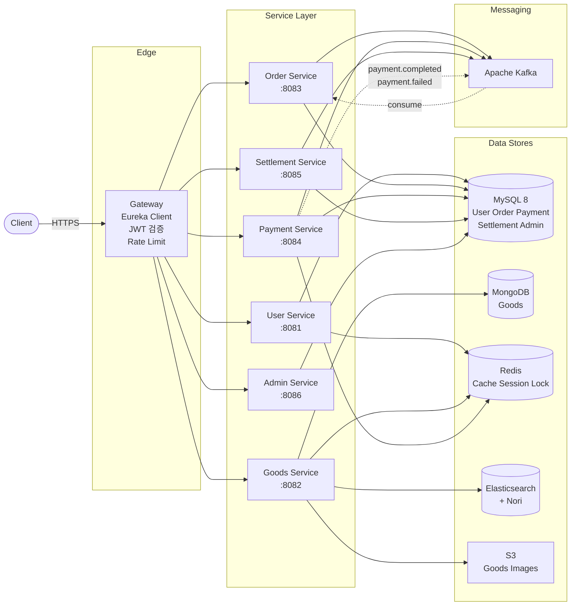
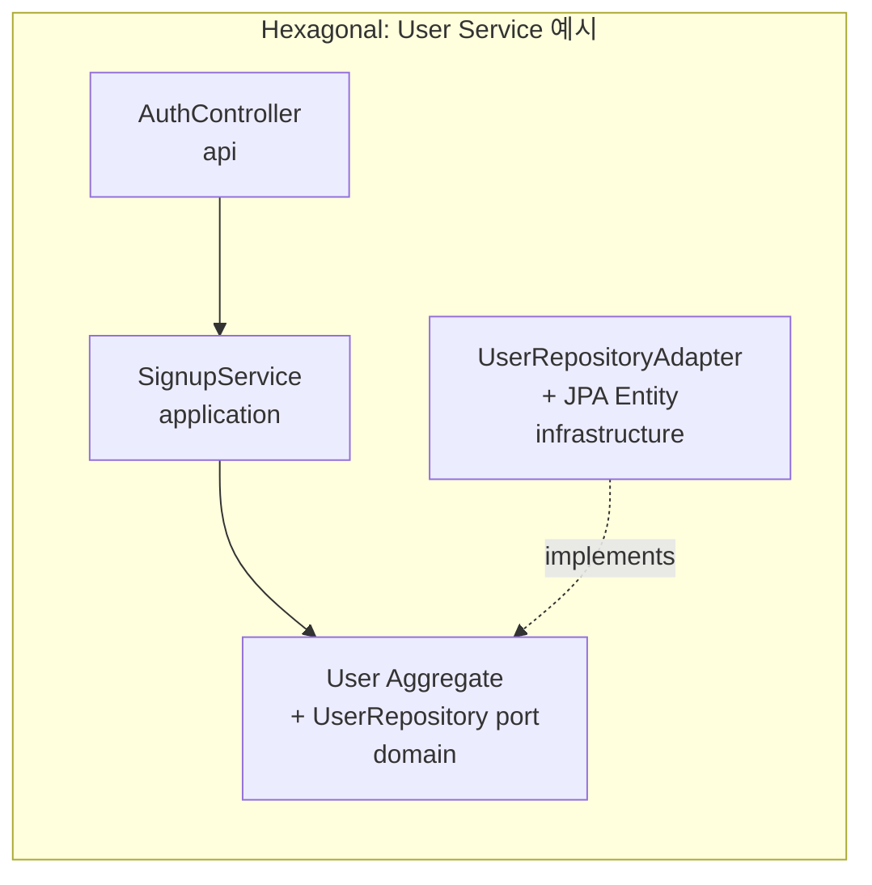
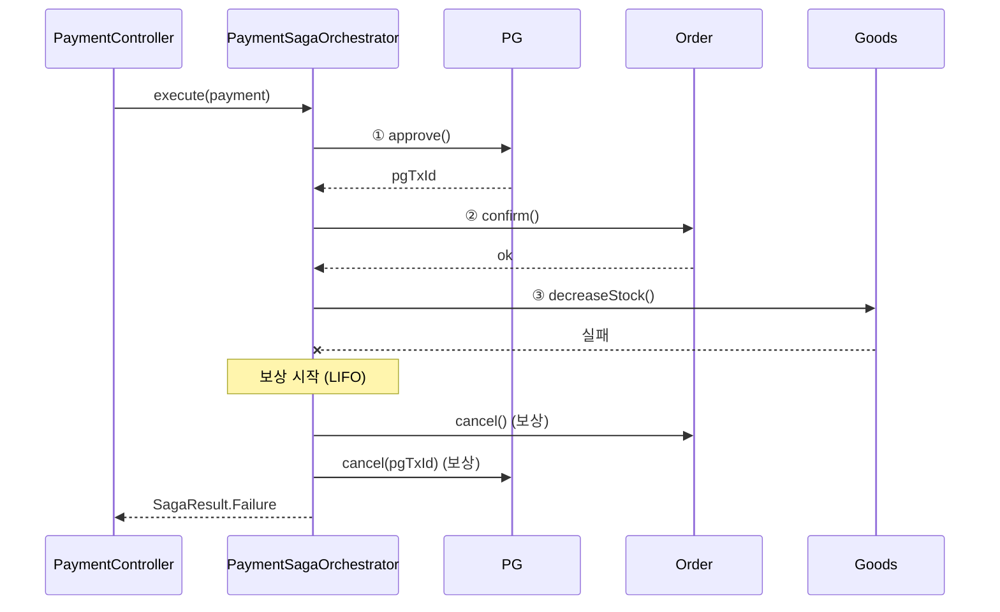
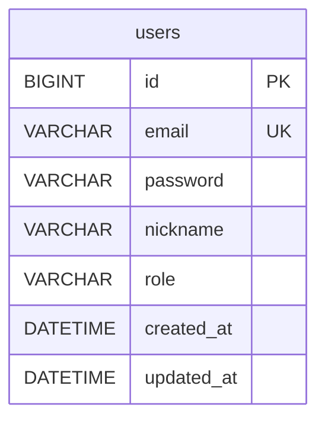
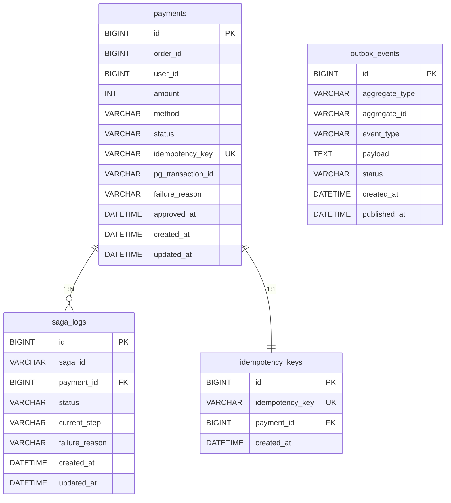
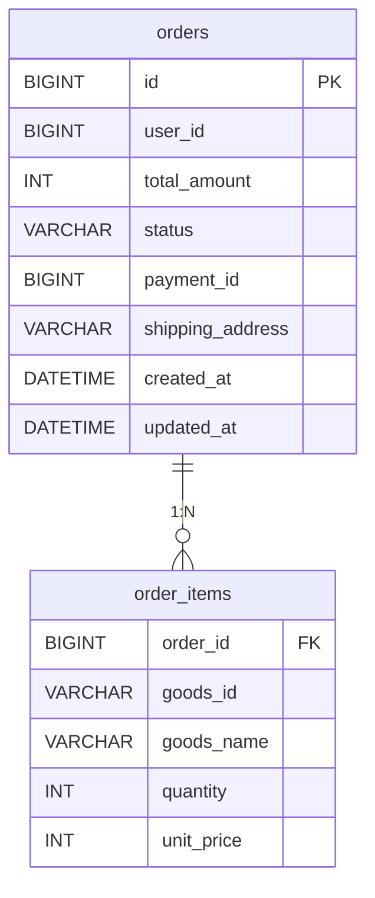
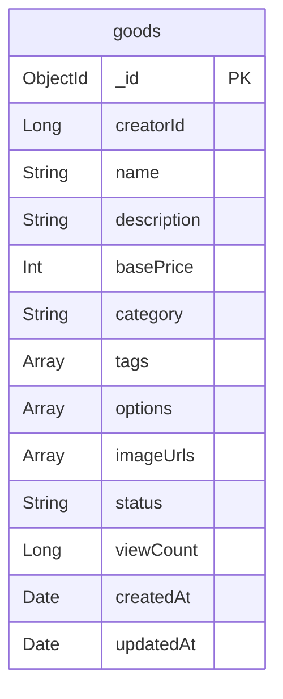

# FanKit

> K-POP 팬아트 크리에이터의 굿즈 거래를 위한 MSA 이커머스 플랫폼

[](https://kotlinlang.org)
[](https://spring.io/projects/spring-boot)
[](https://gradle.org)

크리에이터가 K-POP 팬굿즈를 등록·판매하고 팬이 안전하게 결제·구매할 수 있는 플랫폼. 결제·정산 도메인의 정합성과 검색·재고 관리의 동시성 처리에 초점을 맞춰 설계되었습니다.

## 목차

1. [아키텍처](#아키텍처)
2. [모듈 구조 (Hexagonal)](#모듈-구조-hexagonal)
3. [핵심 패턴](#핵심-패턴)
4. [ERD](#erd)
5. [API 엔드포인트](#api-엔드포인트)
6. [기술 스택](#기술-스택)
7. [실행 방법](#실행-방법)
8. [디렉토리 구조](#디렉토리-구조)
9. [진행 현황](#진행-현황)

---

## 아키텍처

### 시스템 전체



**서비스 분리 원칙**: 도메인 경계 = DB 경계. 한 서비스가 다른 서비스의 DB에 직접 접근하지 않으며, 서비스 간 통신은 동기 호출(Spring Cloud) 또는 비동기 이벤트(Kafka)로 명시적으로 이뤄집니다.

---

## 모듈 구조 (Hexagonal)

각 서비스는 동일한 4계층 구조로 구성됩니다.

```
┌─────────────────────────────────────┐
│           api  (Controller)          │  ← Spring Boot 진입점, HTTP 노출
├─────────────────────────────────────┤
│       application  (UseCase)         │  ← 비즈니스 흐름 조율, 트랜잭션 경계
├─────────────────────────────────────┤
│           domain  (Pure)             │  ← 도메인 모델 + Port 인터페이스
├─────────────────────────────────────┤
│  infrastructure  (JPA/Mongo/PG/...)  │  ← Port 구현체 (Adapter)
└─────────────────────────────────────┘
```

**Hexagonal 원칙**

- `domain`은 Spring을 포함한 어떤 외부 프레임워크에도 의존하지 않는 Pure Kotlin
- 외부 시스템 호출은 `domain.port.outbound` 인터페이스로 추상화
- `infrastructure`가 port 구현 (JPA Adapter, S3 Adapter 등)
- 도메인 → 인프라 방향 의존 절대 금지 (의존성 역전)

이렇게 분리하면 도메인 로직을 외부 시스템 없이 단위 테스트 가능하고, 저장소를 MySQL → PostgreSQL로 바꿔도 도메인 코드는 변경되지 않습니다.



---

## 핵심 패턴

### 1. Saga (Orchestration)

분산 트랜잭션 정합성. 각 서비스의 로컬 트랜잭션을 단계별로 호출하고, 실패 시 LIFO 순서로 보상.



`SagaLog` 테이블에 단계별 상태(`STARTED → COMPENSATING → COMPENSATED / COMPENSATION_FAILED`)를 영속화하여 운영 가시성 확보. Choreography 대비 Orchestration의 트레이드오프: 중앙 코디네이터에 결합도가 생기지만 흐름이 한 곳에 명시되어 진단·디버깅이 단순.

### 2. Idempotency Key (이중 체크)

동일 요청 중복 결제 차단. 클라이언트가 `X-Idempotency-Key` 헤더에 UUID 발급.

```
1차) Redis cache hit  → 즉시 이전 결과 반환 (DB hit 절약)
2차) cache miss       → DB unique constraint
                       (race condition 시 1건만 통과, 나머지는 기존 결과 조회)
```

Redis가 빠른 1차 방어선, MySQL의 `unique index`가 SoT(Source of Truth) + 최후 보루.

### 3. 비관적 락 vs 분산 락

| 종류 | 사용 위치 | 매커니즘 | 적용 기준 |
|---|---|---|---|
| 비관적 락 | Payment Service: 동일 `orderId` 중복 결제 차단 | `SELECT ... FOR UPDATE` (Spring Data JPA `@Lock(PESSIMISTIC_WRITE)`) | 자원이 단일 DB scope |
| 분산 락 | Goods Service: 인기 굿즈 재고 차감 동시성 | Redisson (Redis + Lua script atomic, Pub/Sub로 wait queue) | 자원이 여러 인스턴스/서비스 scope |

### 4. Circuit Breaker (Resilience4j)

PG사 같은 외부 의존성의 일시 장애가 전체 시스템 장애로 전파되는 것을 차단. Mock PG 호출 메서드에 `@CircuitBreaker(name = "pgClient", fallbackMethod = "approveFallback")` 적용.

| 파라미터 | 값 | 근거 |
|---|---|---|
| `failureRateThreshold` | 50% | 절반 이상 실패 시 OPEN |
| `slidingWindowSize` | 10건 | 작은 표본으로 빠른 감지 |
| `waitDurationInOpenState` | 30초 | PG 일시 장애의 평균 회복 시간 추정 |

OPEN 상태에선 fallback이 즉시 도메인 예외(`PgUnavailableException`)를 발생 → Saga가 곧장 실패 분기로 진행 (fail fast).

### 5. Transactional Outbox

DB 트랜잭션 commit과 Kafka 이벤트 발행의 원자성 보장.

```
[ 같은 DB tx ]                                    [ 별도 스케줄러 ]
                                                  ┌──────────────────┐
Payment INSERT             ─── commit ─────▶      │ OutboxRelay      │
   +                                              │ (1초 주기)       │
OutboxEvent INSERT (PENDING)                      │ pull PENDING     │
                                                  │ → Kafka send     │
                                                  │ → mark PUBLISHED │
                                                  └──────────────────┘
```

`Kafka.publish()`를 직접 호출 시 발생할 수 있는 inconsistency: DB rollback인데 이벤트는 발행됨. Outbox 패턴은 같은 DB 트랜잭션 내에 이벤트 row를 적재하고, 별도 relay가 PENDING 행만 발행 → at-least-once 보장 (소비자 측 멱등 처리 필요).

### 6. JWT 이중 토큰 + Refresh Rotation

| 토큰 | 만료 | 저장 위치 | 역할 |
|---|---|---|---|
| Access | 30분 | client only (stateless) | 일반 API 인증 |
| Refresh | 7일 | Redis (server-side) | Access 재발급 |

**왜 Refresh를 Redis에?**

- Access는 stateless → 탈취되면 만료까지 무효화 불가
- Refresh를 server-side에 두면 탈취 의심 시 즉시 Redis key 삭제로 해당 사용자 강제 로그아웃 가능

**Rotation**: 매 갱신마다 새 Refresh도 발급 + Redis 갱신 → 탈취된 토큰의 사용 수명 제한.

### 7. Elasticsearch + Nori (한국어 형태소 검색)

MongoDB의 `$text`는 한국어 형태소 분석 미지원. "민호 키링"과 "민호의 키링"이 매치되지 않음. ES에 `analysis-nori` plugin 빌트인한 커스텀 이미지로 형태소 단위 분석 적용.

```json
// goods-settings.json
{
  "analysis": {
    "analyzer": {
      "korean": { "type": "nori", "decompound_mode": "mixed" }
    }
  }
}
```

본문(SoT)은 MongoDB, 검색 인덱스는 ES — 굿즈 등록 시 양쪽에 동시 저장 (eventually consistent 허용).

### 8. Redis Sorted Set 인기 랭킹

`SELECT * FROM goods ORDER BY view_count DESC LIMIT N`은 호출마다 인덱스/풀스캔. Redis Sorted Set은:

- `ZINCRBY goods:ranking <goodsId> 1` → O(log N) 점수 누적
- `ZREVRANGE goods:ranking 0 N-1` → O(log N + n) top-N 즉시 조회

영구 카운트는 Mongo `$inc viewCount` (atomic), 실시간 랭킹 캐시는 Redis. 두 저장소 갱신은 별 트랜잭션이지만 인기 랭킹은 정확도가 critical하지 않아 eventually consistent 허용.

### 9. S3 Pre-signed URL

서버 경유 업로드 시 메모리/디스크/대역폭 부담. Pre-signed URL 패턴:

```
1) 클라이언트 → 서버: 업로드 URL 발급 요청 (filename, content-type)
2) 서버 → 클라이언트: 임시 권한 PUT URL (5분 유효) + 추후 publicUrl
3) 클라이언트 → S3: 직접 PUT (서버 미경유)
4) 클라이언트 → 서버: publicUrl을 굿즈 imageUrls에 저장
```

객체 키 규약: `goods/{yyyy/MM/dd}/{creatorId}/{uuid}.{ext}` — 날짜 prefix로 라이프사이클 정책 적용 용이, UUID로 충돌 방지 + 원본 파일명 비노출.

---

## ERD

### User Service (MySQL)



### Payment Service (MySQL)



### Order Service (MySQL)



`order_items.goods_name`/`unit_price`는 주문 시점 스냅샷 — 굿즈 가격이 변해도 주문 금액은 보존.

### Goods Service (MongoDB)



`options`는 굿즈 카테고리별로 스키마가 다름 (포토카드: `[{name:"멤버", values:[...]}]`, 의류: `[{name:"사이즈", values:[...], additionalPrices:{...}}]`). RDB의 정형 스키마로 표현하기 부적합 → MongoDB의 document model이 자연스러운 fit.

---

## API 엔드포인트

### Auth (`/api/v1/auth`)

| Method | Path | 설명 |
|---|---|---|
| POST | `/signup` | 회원가입 |
| POST | `/login` | 로그인 (Access + Refresh 발급) |
| POST | `/refresh` | Access Token 재발급 (Rotation 동작) |

### Goods (`/api/v1/goods`)

| Method | Path | 설명 |
|---|---|---|
| POST | `/` | 굿즈 등록 (Mongo + ES 동시 저장) |
| GET | `/{id}` | 단건 조회 + viewCount/랭킹 증가 |
| GET | `/search?keyword=&category=` | Nori 형태소 검색 |
| GET | `/popular?n=10` | Redis Sorted Set 기반 top-N |
| POST | `/upload-url` | S3 Pre-signed URL 발급 |

### Order (`/api/v1/orders`)

| Method | Path | 설명 |
|---|---|---|
| POST | `/` | 주문 생성 (PAYMENT_PENDING 상태로 시작) |
| GET | `/{id}` | 단건 조회 |
| POST | `/{id}/confirm` | Saga 동기 RPC: PAYMENT_PENDING → PAID (멱등) |
| POST | `/{id}/cancel` | Saga 보상: PAYMENT_PENDING/PAID → CANCELLED (멱등) |

`payment.completed` / `payment.failed` Kafka 이벤트도 같은 도메인 액션으로 라우팅 (at-least-once 재전송 안전).

### Payment (`/api/v1/payments`)

| Method | Path | Header | 설명 |
|---|---|---|---|
| POST | `/` | `X-Idempotency-Key` | 결제 생성 (Saga 실행) |
| GET | `/{id}` | - | 결제 단건 조회 |
| POST | `/{id}/refund` | - | 환불 |

---

## 기술 스택

| 영역 | 기술 |
|---|---|
| Language | Kotlin 1.9.25, JDK 17 |
| Framework | Spring Boot 3.2.5, Spring Cloud 2023.0.1 |
| RDB | MySQL 8.0 + Spring Data JPA |
| Document DB | MongoDB 7.0 + Spring Data MongoDB |
| Cache / Lock | Redis 7.2 + Redisson (분산 락) |
| Search | Elasticsearch 8.13.4 + analysis-nori |
| Object Storage | AWS S3 (presigned URL) |
| Messaging | Apache Kafka 7.5 (Confluent) |
| Resilience | Resilience4j 2.2 (Circuit Breaker) |
| Batch | Spring Batch + Quartz (계획) |
| Service Discovery | Spring Cloud Netflix Eureka (계획) |
| Observability | Spring Boot Actuator + Prometheus + Grafana |
| Testing | JUnit 5, MockK, Kotest assertions, Testcontainers |
| Build | Gradle 8.5 (Kotlin DSL), Multi-Module |

---

## 실행 방법

### 1. 인프라 기동

```bash
docker-compose up -d
```

기동되는 컨테이너:
- MySQL 8 (3306) — 5개 schema 자동 생성 (`fankit_user`, `fankit_order`, `fankit_payment`, `fankit_settlement`, `fankit_admin`)
- MongoDB 7 (27017)
- Redis 7 (6379)
- Kafka + Zookeeper (9092 / 2181)
- Elasticsearch + Nori (9200), Kibana (5601)
- Prometheus (9090), Grafana (3000)

### 2. 빌드

```bash
./gradlew build
```

### 3. 개별 서비스 실행

```bash
./gradlew :user-service:user-api:bootRun        # :8081
./gradlew :goods-service:goods-api:bootRun      # :8082
./gradlew :payment-service:payment-api:bootRun  # :8084
./gradlew :gateway:bootRun                      # :8080
```

### 4. 동작 확인

```bash
# 회원가입
curl -X POST localhost:8081/api/v1/auth/signup \
  -H 'Content-Type: application/json' \
  -d '{"email":"a@b.com","password":"password123","nickname":"nick"}'

# 결제 생성 (Idempotency Key 필수)
curl -X POST localhost:8084/api/v1/payments \
  -H 'Content-Type: application/json' \
  -H 'X-Idempotency-Key: 11111111-2222-3333-4444-555555555555' \
  -d '{"orderId":1,"userId":1,"amount":5000,"method":"KAKAO_PAY",
       "items":[{"goodsId":"abc","quantity":1}]}'

# 같은 키로 재요청 → 이전 결과 그대로 반환 (Idempotency 동작)
```

---

## 디렉토리 구조

```
fankit/
├── build.gradle.kts                     # 루트: Spring BOM, Kotlin 설정
├── settings.gradle.kts                  # 26개 모듈 동적 include
├── gradle.properties                    # 병렬·캐시 빌드
├── docker-compose.yml                   # 9개 인프라 컨테이너
├── infra/
│   ├── elasticsearch/Dockerfile         # Nori plugin 빌트인 이미지
│   ├── mysql/init/01-create-databases.sql
│   ├── prometheus/prometheus.yml
│   └── grafana/provisioning/datasources/prometheus.yml
├── common/                              # ApiResponse, BaseEntity, Exception
├── gateway/                             # Spring Cloud Gateway + Eureka
├── user-service/
│   ├── user-domain/                     # Pure Kotlin
│   ├── user-application/                # @Service UseCase
│   ├── user-infrastructure/             # JPA + Redis + Security 어댑터
│   └── user-api/                        # Controller + Boot 진입점
├── goods-service/                       # (4 sub-modules, Mongo+ES+Redis+S3)
├── order-service/                       # (4 sub-modules, MySQL+Kafka)
├── payment-service/                     # (4 sub-modules, ⭐ Saga 핵심)
├── settlement-service/                  # (4 sub-modules, Spring Batch)
└── admin-service/                       # (4 sub-modules)
```

---

## 진행 현황

| Phase | 작업 | 상태 |
|---|---|---|
| 1 | Gradle Multi-Module 골격 (26 modules) | ✅ |
| 1 | docker-compose 인프라 (MySQL/Mongo/Redis/Kafka/ES/Prometheus/Grafana) | ✅ |
| 2 | User Service (signup/login/refresh + JWT Rotation) | ✅ |
| 2 | Goods Service (Mongo + ES Nori + Redis Sorted Set + S3) | ✅ |
| 2 | Order Service (상태 머신 + Kafka payment 이벤트 consumer + 멱등 처리) | ✅ |
| 2 | Admin Service | ⬜ |
| 3 | Payment Service (Saga + Idempotency + CB + Outbox + 분산 락) | ✅ |
| 3 | Settlement Service (Spring Batch + Reconciliation) | ⬜ |
| 4 | Testcontainers 통합 테스트 | ⬜ |
| 4 | GitHub Actions CI/CD | ⬜ |
| 4 | Eureka Server + Spring Cloud Config | ⬜ |
